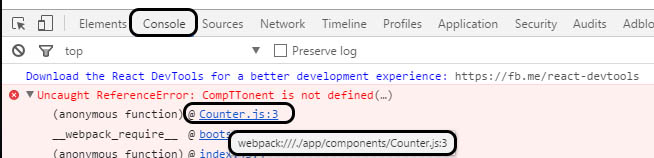

# Simple Koa2 - React - Redux boilerplate

## Project setup guide:
Before we start we need to setup a project folder and initialise the package.json.
```bash
$ npm init
```


## Folder structure:
```bash
project  
│   .babelrc
│   babel.hook.js
│   package.json
│   webpack.config.js  
│
└───app
│   │   application data (react redux)
│
└───extensions
│   │   different extensions e.g. api setup etc.
│     
└───server
    │   index.html.js
    │   index.js  
```

### 1. Babel:
#### Installation:
Babel hook and polyfill
- register as the hook to make sure we can write in ES6/7 on the server side
- polyfill is required for new build ins like Promise that are required for Koa2
```bash
$ npm install babel-polyfill@6.26.0 babel-register@6.26.0
```

Babel presets and loader:
- es2015 is required for all the es6 features like commonJs modules, arrow-functions etc.

- stage-0 all new features including async functions / class-properties required for koa2 / react
- react is required for the react jsx syntax etc.
- babel-loader is required for the webpack setup - client side
```bash
$ npm install babel-preset-env@1.6.0 babel-preset-stage-0@6.24.1 babel-preset-react@6.24.1 babel-loader@7.1.2 --save-dev
```

#### Setup:
__babelrc:__  
Once all the babel modules are installed, create a file named .babelrc with the following content:

```json
{
  "presets": [ "env", "stage-0", "react" ]
}
```
The file defines the presets that the webpack babel-loader and the babel hook will use.  

__Babel hook:__  
The entry point for the server side will be a babel hook and the polyfill that includes the presets based on the .babelrc file. For that we create a babel.hook.js file with the following code:

```javascript
'use strict';
require('babel-register');
require('babel-polyfill');
require('./app/index.js');
```

__package.json:__  
Last point here is to add a script shortcut in the package.json:
```json
"scripts": {
  "..."
  "start": "node babel.hook.js"
},
```

### 2. Webpack:
#### Installation:

```bash
$ npm install webpack@3.7.1 --save-dev
```

#### Setup:

__webpack.config.js:__  
Very basic webpack setup.

```javascript
module.exports = {
  devtool: 'source-map',
  entry: ['babel-polyfill', __dirname + "/app/index.js"],
  output: {
    path: __dirname + "/build",
    filename: "bundle.js"
  },
  module: {
    rules: [{
        test: /\.css$/,
        use: ['style-loader', 'css-loader']
      },
      {
        test: /\.js$/,
        exclude: /node_modules/,
        loader: 'babel-loader'
      }
    ]
  }
}
```
- devtool: 'source-map' adds source mapping. More infos [here](http://webpack.github.io/docs/configuration.html#devtool).  
You can see the mapping in the browser like this:

- entry contains the babel-polyfill for the latest js globals and points to the file where the react components get rendered
- output is the bundle.js in build path
  - the bundle.js needs to get refeenced in the html template
  - the build path needs to get served that the client can access it
- we only use two loaders here to translate the react/es6 stuff via babel and enable css imports and files

__package.json:__  
Last point here is to add a script shortcut in the package.json:
```json
"scripts": {
  "..."
  "build": "webpack"
},
```
### 3. Koa2
#### Installation:
We need the core koa2 module and we also need to have something to server our bundle.js from webpack. We'll use koa-static as this is koa2 compatible.
Install both via:
```bash
$ npm install koa@2.3.0 koa-static@4.0.1
```
#### Setup:

__index.html.js:__  
In this js file we have a function that returns a string that represents our html file. In our case we are passing in a sting as the title.  

Important is:
- to make sure that the html contains a div element with the id "root" which is used in the react part to inject the components.
- to add the bundle.js as a script. This will be generated via webpack and served via koa-static.

here is how the body looks:
```html
<body>
  <div id="root"></div>
  <script>
  </script>
  <script type="text/javascript" src="bundle.js"></script>
</body>
```
__index.js:__  
The index.js contains the koa2 setup and the core of it looks like this:
```javascript
// serve static files e.g. bundle.js
app.use(serve('./build'))

// set the initial content
app.use((ctx, next) => {
  ctx.body = html('hello')
})

// start server at port 3000
app.listen(3000)
console.log('Server is listening at port: 3000')
```
There are two important steps here:
 - use koa-static to serve the build path that is used by webpack to place the bundle.js
 - set the body to be the template html that includes the "root" id for the react injection and the link to the bundle.js that contains the react code

### 4. Redux React Counter example
To add redux-react content we just copy the code from the redux counter example and place it in the app folder.

First we need to install reast and redux:
```bash
$ npm install react@16.0.0 react-dom@16.0.0 react-redux@5.0.6 redux@3.7.2
```

#### Setup:
Create an app folder.  
Download the code from:  
https://github.com/reactjs/redux/tree/master/examples/counter/src

Place all files (test is not included yet) in the app folder.
Note that our webpack is pointing to the index.js from this example.
